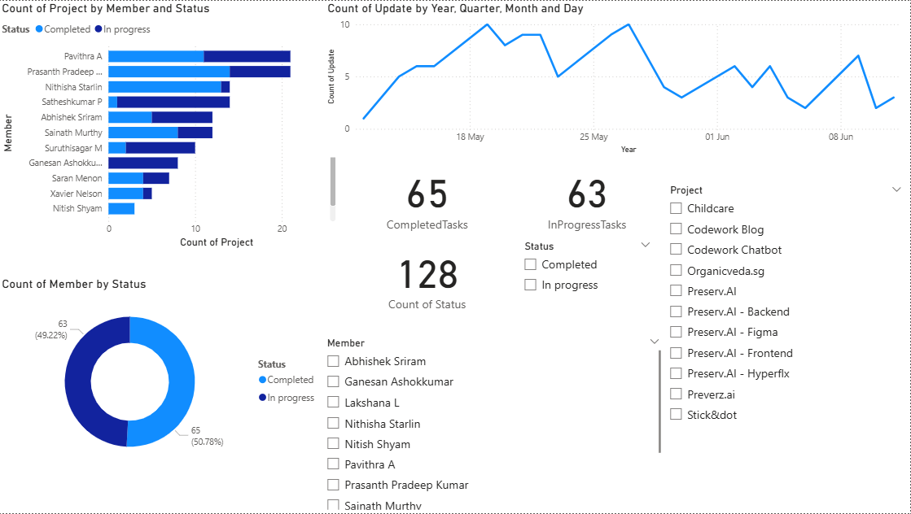

# 🎯 Project Status Dashboard – Built with Power BI

Hi there! 👋  
This is my **first Power BI dashboard**, and I'm excited to share it with you.

It’s a project status tracker that helps visualize how different team members are progressing on tasks across multiple projects. The dashboard gives a quick and clear overview of completed vs in-progress tasks, individual contributions, and daily updates — all wrapped in a clean, interactive layout.

---

## 📸 Dashboard Preview

---

## 🔍 What This Dashboard Shows

- ✅ Number of completed vs. in-progress tasks  
- 👥 Breakdown of each member’s project count  
- 📈 Daily task updates over time  
- 🎯 Filters for project and member selection  

Everything updates dynamically so you can explore the data your own way.

---

## 🧰 Tools & Skills Used

- **Power BI Desktop**
- **DAX (Data Analysis Expressions)**
- **Data Modeling & Cleaning**
- **Interactive Charts & Slicers**

---

## 📁 What’s in the Repo

- `power.pbit` – Power BI template file you can open and explore  
- `dashboard.png` – A snapshot of the dashboard view

---

## 💼 About Me

I'm currently learning and building hands-on projects in the **Data Analytics** space.  
This is the first step in my journey — and I'm just getting started 🚀

I’m open to:
- Internship opportunities
- Freelance projects
- Remote analyst roles

Let’s connect on [LinkedIn](https://www.linkedin.com/in/selva-surya-e-332006031e/)  
Feel free to check out the dashboard and share your feedback!

---

## 🙌 Thanks for stopping by!

If you found this project interesting or helpful, feel free to star ⭐ this repo or connect with me!
